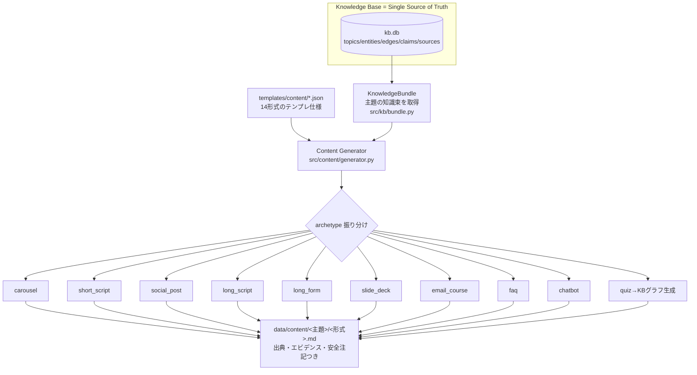

# Content Generator 設計書（医学コンテンツ生成エンジン）

Knowledge Base（KB）を **唯一の情報源（Single Source of Truth, SSoT）** とし、
同じ知識から14形式の教育コンテンツを生成するエンジン。

> **原則**: すべての生成物は KB(kb.db) からのみ作られる。
> 生成器は NotebookLM / YouTube / inbox / 生ファイルを一切参照しない。
> （コード上、`src/content/*` が読むのは `src/kb/store.py` 経由の kb.db のみ）

---

## 1. 設計図（パイプライン）



**14形式 → 9アーキタイプ**（重複ロジックを共通化。ジャンル増加に強い）:

| # | 形式 | archetype | 対象 |
|---|---|---|---|
| ① | 4択クイズ | quiz(グラフ生成) | 一般〜専門 |
| ② | Instagramカルーセル | carousel | 一般 |
| ③ | Instagramリール台本 | short_script | 一般 |
| ④ | Threads投稿 | social_post(500字) | 一般 |
| ⑤ | X投稿 | social_post(140字) | 一般 |
| ⑥ | YouTube動画台本 | long_script | 一般 |
| ⑦ | YouTubeショート | short_script | 一般 |
| ⑧ | 患者向け説明資料 | long_form(患者) | 患者 |
| ⑨ | 整体師向け勉強資料 | long_form(整体師) | 専門 |
| ⑩ | HALII Academyスライド | slide_deck | 受講者 |
| ⑪ | ブログ記事 | long_form(一般) | 一般 |
| ⑫ | メール講座 | email_course | 一般 |
| ⑬ | FAQ | faq | 一般 |
| ⑭ | AIチャットボット回答 | chatbot | 一般 |

---

## 2. フォルダ構成（Content部分）

```
quiz_system/
├── templates/content/            # ★テンプレート仕様（ドロップインで形式追加）
│   ├── quiz.json
│   ├── instagram_carousel.json
│   ├── instagram_reel.json
│   ├── threads.json  x.json
│   ├── youtube_script.json  youtube_short.json
│   ├── patient.json  practitioner.json  blog.json
│   ├── halii_slide.json  email_course.json
│   ├── faq.json  chatbot.json
│   └── （新ジャンルはここに1ファイル追加するだけ）
├── src/
│   ├── kb/
│   │   └── bundle.py             # ★KnowledgeBundle（KBのみ参照＝SSoTの唯一の読み口）
│   └── content/
│       ├── generator.py          # ★テンプレ読込→振分→出力
│       └── renderers.py          # ★archetype別レンダラ（9種）
└── data/content/<主題>/<形式>.md  # ★生成物（出典・エビデンス・安全注記つき）
```

---

## 3. テンプレート構成（JSON仕様）

各形式は1つのJSONで定義する。**新ジャンル = JSONを1枚足すだけ**（コード変更不要。
既存アーキタイプを使う場合）。

```json
{
  "format": "instagram_carousel",     // 一意な形式ID
  "label": "Instagramカルーセル",       // 表示名
  "aliases": ["instagram","carousel","ig","インスタ"],  // CLIで使える別名
  "archetype": "carousel",            // 使うレンダラ（9種のいずれか）
  "audience": "一般",                  // 読み手（long_formの語り口を切替）
  "tone": "やさしい・簡潔",
  "min_evidence": "B",                // この形式で使う最低エビデンス（quizはA）
  "config": {                          // archetype固有の設定
    "max_slides": 8,
    "hashtags": ["#女性の身体","#解剖学","#性教育"]
  },
  "safety": true                       // 安全・同意・個人差の注記を必須化
}
```

archetype 固有 config 例:
- `carousel`: `max_slides`, `hashtags`
- `short_script`: `seconds`, `points`
- `social_post`: `max_chars`, `max_posts`
- `email_course`: `days`

---

## 4. CLI 一覧

```bash
# 生成
python -m src.pipeline generate <format|別名> "<主題>"
    例) generate instagram "陰部神経"
        generate slide "骨盤底筋"
        generate youtube "陰核"
        generate patient "性交痛"
        generate quiz "女性器"
python -m src.pipeline content-all "<主題>"     # 全14形式を一括生成
python -m src.pipeline content-list             # 生成可能な形式と別名の一覧

# Knowledge Base（生成の材料）
python -m src.pipeline kb-build                 # シード/既存データ→kb.db 統合
python -m src.pipeline kb-stats                 # KB統計
python -m src.pipeline kb-generate A [topic]    # Evidence Aのグラフから4種クイズ

# 取り込み〜検証〜承認（KBの手前）
python -m src.pipeline ingest / load-verified / build-quiz / review / approve / status
```

主題(subject)は **topic名**（例「女性器」「神経支配」）か **entity名/別名**
（例「陰部神経」「クリトリス」）で指定。KBの別名テーブルで名寄せされる。

---

## 5. 「KBを更新すると全コンテンツが最新化」する仕組み

- 生成は **KBの純粋な関数**（同じKB状態→同じ出力）。乱数を使わず再現可能。
- 各生成物のヘッダに `kb_version`（claim数c/edge数e）を刻む → 陳腐化を検知可能。
- KB更新後は次の一括再生成で全形式が最新版へ:
  ```bash
  python -m src.pipeline kb-build            # KBを更新
  python -m src.pipeline content-all "陰核"   # その主題の全14形式を作り直し
  ```
- テストで担保: `tests/test_content.py::test_kb_update_reflected`
  （検証済みclaimを足すと生成の素になる fact が増える）。

---

## 6. 100ジャンル追加しても保守できる設計

1. **形式追加は宣言的**: 既存アーキタイプで良ければ `templates/content/xxx.json` を1枚置くだけ。
   コード変更なしで新形式がCLIに出現（`content-list` に自動反映）。
2. **アーキタイプに集約**: 14形式→9アーキタイプ。似た構造(SNS短文/長文記事/スライド/Q&A)は
   共通レンダラを再利用。形式が100種でもアーキタイプは十数個に収まる。
3. **主題(ジャンル)の追加はKB側で完結**: 新テーマは `data/kb/` にエンティティ/エッジ/claimを
   足して `kb-build` するだけ。生成器は無改修で新テーマを扱える（主題名で解決）。
   テーマ別シャーディング（`data/kb/<topic>/`）で100テーマでも入力が整理される。
4. **出典・安全の自動付与を一元化**: `bundle.py` の SAFETY_NOTES と `renderers` の
   `_sources_block/_safety_block` を通すため、全形式・全ジャンルで安全表記と出典追跡が保証される。
   ルール変更は1箇所で全形式に波及。
5. **SSoTでの一貫性**: 事実はKBに一元管理。ジャンルや形式が増えても「同じ知識・同じ出典」から
   生成されるため、媒体間で内容が矛盾しない。KB修正が全媒体に伝播する。
6. **品質の共通ゲート**: 生成物は既存の QA / 採点 / 10観点レビュー / 承認フローに接続可能。
   量産時も「公開前に人間の医学的確認」を維持できる。

### 拡張の型（例）
- 新形式「TikTok台本」→ `short_script` を使い `templates/content/tiktok.json` を追加。
- 新形式「学会ポスター」→ 新アーキタイプ `poster` を1つ実装し、以後は各ジャンルで再利用。
- 新ジャンル「男性器」→ `data/kb/` にエンティティ/エッジ/claimを追加し `kb-build`。
  既存14形式がそのまま `generate <format> "<新ジャンル主題>"` で生成可能。
