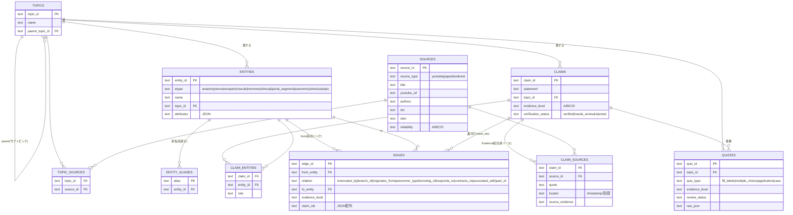

# Knowledge Base 設計書（ER図 / フォルダ / DB / スケール）

本システムは「動画ごと」ではなく **「テーマごとの医学知識」** を蓄積する
Knowledge Base（KB）＋ Knowledge Graph（KG）型へ進化した。

```
複数の動画 / 複数のNotebookLM / 複数の論文 / 複数の教科書
        │  取り込み・正規化・名寄せ
        ▼
   Knowledge Base（テーマ中心に統合）
        │  claim統合（1主張=多ソース）
        ▼
   Evidence統合（A/B/C/D を合成・確定）
        │  エンティティ間リンク
        ▼
   Knowledge Graph（陰核→陰核背神経→陰部神経→S2-S4→…）
        │  Evidenceフィルタ（例: Aのみ）
        ▼
   4種クイズ自動生成（穴埋め / 4択 / 応用 / ケース）
```

---

## 1. ER図（Mermaid）



### 中心概念
- **Topic**：知識を束ねる軸（女性器 → 外性器/内性器/神経支配/…）。動画・論文・教科書はすべて Topic に紐づく。
- **Source**：youtube / paper / textbook を1テーブルに統合。`source_type` で区別。
- **Claim**：医学的主張。`claim_sources` を介して **複数ソースに支えられる（Evidence統合）**。
- **Entity**：知識グラフのノード（Anatomy/Nerve/Receptor/Muscle/Hormone/Clinical/…）。`entity_aliases` で俗称を正式名へ名寄せ。
- **Edge**：エンティティ間の有向リンク（陰核背神経 —branch_of→ 陰部神経）。各エッジは `evidence_level` と裏付け `claim_ids` を持つ。
- **Quiz**：グラフ/claim から生成。`quiz_type` で4種を区別。

---

## 2. フォルダ構成

```
quiz_system/
├── CLAUDE.md / README.md / .env.example
├── config/config.json
├── templates/                     # NotebookLM入力プロンプト・書き出し雛形
├── inbox/notebooklm_exports/      # 動画由来の書き出し投入口
├── agents/                        # 7エージェントの役割定義
├── docs/
│   └── KB_DESIGN.md               # 本書(ER図/DB/スケール)
├── data/
│   ├── sources/                   # 動画ソースの取り込み結果(sources.json 等)
│   ├── claims/                    # verified/rejected/claims.json
│   ├── kb/                        # ★KBシード(テーマ中心)
│   │   ├── topics.json            #   テーマ階層
│   │   ├── entities.json          #   エンティティ(ノード)
│   │   ├── edges.json             #   ナレッジグラフ(エッジ)
│   │   ├── kb_claims.json         #   論文/教科書由来のclaim(Evidence統合)
│   │   ├── sources_extra.json     #   論文/教科書ソース
│   │   └── topic_sources.json     #   テーマ↔ソース紐付
│   ├── quizzes/
│   │   ├── quiz_source.json       # 手書きクイズ定義
│   │   ├── kb_generated/          # ★グラフ自動生成クイズ(draft)
│   │   ├── drafts/ approved/ rejected/
│   │   └── review_candidates.md
│   ├── reports/                   # QA/採点レポート
│   └── database/
│       ├── quiz.db                # 既存パイプラインDB
│       └── kb.db                  # ★Knowledge Base 本体(SQLite)
├── src/
│   ├── schemas.py db.py pipeline.py
│   ├── ingestion/ normalization/ claims/ quiz_generation/
│   ├── validation/ (qa.py score.py evaluate.py)
│   ├── export/
│   └── kb/                        # ★KBサブシステム
│       ├── schema.py              #   DDL(テーブル+インデックス)
│       ├── store.py               #   KBストア(UPSERT/クエリ/Evidence関数)
│       ├── build.py               #   シード→kb.db 統合ビルダー
│       ├── graph.py               #   グラフ探索(近傍/多段/Evidence統合)
│       └── generate_kb.py         #   4種クイズ生成
└── tests/ (test_pipeline.py test_kb.py)
```

**テーマ別シャーディング（拡張時）**：`data/kb/` を将来 `data/kb/<topic>/` に分割し、
テーマ単位で `entities.json` / `edges.json` / `claims.json` を保持できる。ビルダーは
全シャードを走査して1つの `kb.db` に統合する（DBは1つ、入力ファイルはテーマ分割）。

---

## 3. データベース設計

### テーブルと役割
| テーブル | 役割 | 主キー | 主な多対多 |
|---|---|---|---|
| topics | テーマ階層 | topic_id | (self-parent) |
| sources | 動画/論文/教科書 | source_id | — |
| topic_sources | テーマ↔ソース | (topic_id, source_id) | ○ |
| entities | KGノード | entity_id | — |
| entity_aliases | 俗称→正式名 名寄せ | (alias, entity_id) | — |
| claims | 医学的主張 | claim_id | — |
| claim_sources | 主張↔ソース（Evidence統合） | (claim_id, source_id) | ○ |
| claim_entities | 主張↔エンティティ | (claim_id, entity_id) | ○ |
| edges | KGエッジ（関係＋Evidence＋裏付け） | edge_id | — |
| quizzes | 生成クイズ | quiz_id | — |

### インデックス（テーマ/種別/エビデンス絞り込みの高速化）
`sources(source_type)`, `entities(etype)`, `entities(topic_id)`,
`claims(topic_id)`, `claims(evidence_level)`, `claims(verification_status)`,
`claim_sources(source_id)`, `claim_entities(entity_id)`,
`edges(from_entity)`, `edges(to_entity)`, `edges(relation)`, `edges(evidence_level)`,
`quizzes(topic_id)`, `quizzes(quiz_type)`, `quizzes(evidence_level)`。

### Evidence統合ロジック
- `claim_sources` に各ソース単独の評価 `source_evidence` を保持。
- 複数ソースが一致するほど強くなる（`graph.integrated_evidence`：2ソース以上で1段引き上げ、上限A）。
- 最終値は Medical Evidence Reviewer が確定した `claims.evidence_level` を優先。
- **エッジのevidenceは裏付けclaimの最小値を上限にキャップ**（`build.py`）。過大評価を防ぐ。
- クイズ生成は `min_evidence`（例 "A"）でフィルタし、**Evidence A だけでの生成が可能**。

### 整合性・冪等性
- すべて UPSERT（`INSERT OR REPLACE`）で、再実行しても同じ状態に収束。
- 外部キーで参照整合を担保（`PRAGMA foreign_keys=ON`）。
- 別名テーブルでエンティティ重複を統合（同一概念が複数動画で別表記でも1ノード）。

---

## 4. 1000本以上へのスケール設計

### 4.1 データ量の見積り
1動画あたり 主張20〜40 / エンティティ参照 数十 と仮定すると、1000動画で
claims 3〜4万、claim_sources 10万、edges 数千〜1万規模。**SQLiteでも十分**だが、
同時書き込みが増える段階で PostgreSQL へ移行する（スキーマはほぼ無改変で移植可能）。

### 4.2 取り込みのスケール
- **バッチ/増分取り込み**：`inbox/` に投入されたファイル単位で処理、`content_hash` と
  `youtube_url` で**重複スキップ**。失敗はファイル単位で握りつぶしログ化し再実行可能。
- **並列化**：抽出（claim化）はソース独立なので水平並列可能。DB書き込みのみ直列/バッチcommit。
- **名寄せの事前正規化**：`entity_aliases` を先に整備し、取り込み時に O(1) で解決。

### 4.3 クエリのスケール
- テーマ/エビデンス/種別に**インデックス**済み。「女性器テーマの Evidence A のエッジ」等の
  典型クエリはインデックスレンジスキャンで高速。
- グラフ探索は `edges(from_entity)` インデックスで近傍取得 O(次数)。多段探索は
  `max_hops` と `min_evidence` で枝刈り。巨大化時は探索起点をテーマ内に限定。

### 4.4 グラフのスケール
- ノード/エッジは正規化テーブルで保持。数万エッジまではSQLiteの隣接クエリで実用的。
- さらに大規模・複雑な多段推論が必要になれば、`edges` をそのまま
  **グラフDB（Neo4s等）や networkx へエクスポート**できる形（from/relation/to/evidence）。
- テーマ単位の**部分グラフ抽出**で、生成対象を限定してメモリ・時間を一定に保つ。

### 4.5 生成・品質のスケール
- 生成は決定論的（乱数不使用・正解位置は index 由来）で**再現可能**。
- 生成物は必ず既存の **QA→採点(6観点)→レビュー(10観点)→承認** を通す。
  自動生成は `draft` 止まりで、**公開は人間承認後**（安全性を量産時も担保）。
- 重複検出（設問の近似重複）で、1000本規模でも重複問題の氾濫を防ぐ。

### 4.6 移行・運用
- SQLite → PostgreSQL：型は TEXT/INTEGER 中心で互換。JSON列は `jsonb` に置換可能。
- WAL モードで読み取り並行性を確保。バックアップは `kb.db` のコピー or `pg_dump`。
- 監査性：claim→source（引用・locator）まで辿れるため、1万主張規模でも出典追跡が破綻しない。

### 4.7 将来の自動化（Phase 10+）
- Google Drive MCP で NotebookLM 書き出しを自動取得 → `inbox/` へ。
- 論文は DOI、教科書は ISBN でメタデータ補完。
- エンティティ/エッジ抽出を LLM 支援で半自動化（ただし最終Evidence確定は人間）。
